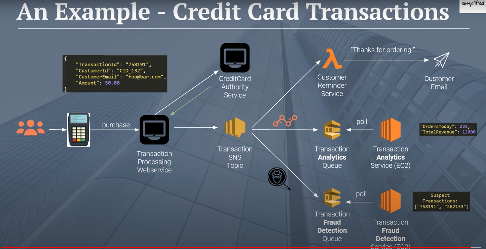

# 401 - Class 19 - AWS: Events

## Why This Topic Matters

Able to integrate and leverage the use of SNS and SQS in applications.

## AWS SQS vs SNS

1. What is the difference betweeen SQS and SNS?  

    * **SNS (Simple Notification Service) is a distributed publish-subscribe service:**
      Amazon SNS is a fast, flexible, fully managed push notification service that lets you send individual messages or to bulk messages to large numbers of recipients. Amazon SNS makes it simple and cost effective to send push notifications to mobile device users, email recipients or even send messages to other distributed services.

      SNS is a distributed publish-subscribe system. Messages are pushed to subscribers as and when they are sent by publishers to SNS.

      SNS supports several end points such as email, sms, http end point and SQS. If you want unknown number and type of subscribers to receive messages, you need SNS.

      With Amazon SNS, you can send push notifications to Apple, Google, Fire OS, and Windows devices, as well as to Android devices in China with Baidu Cloud Push. You can use SNS to send SMS messages to mobile device users in the US or to email recipients worldwide.

    * **SQS (Simple Queue Service) is distributed queuing service:**  
      Amazon SQS is a fully managed message queuing service that enables you to decouple and scale microservices, distributed systems, and serverless applications.

      SQS is distributed queuing system. Messages are not pushed to receivers. Receivers have to poll SQS to receive messages. Messages can be stored in SQS for short duration of time (max 14 days).

      Messages can’t be received by multiple receivers at the same time. Any one receiver can receive a message, process and delete it. Other receivers do not receive the same message later. Polling inherently introduces some latency in message delivery in SQS unlike SNS where messages are immediately pushed to subscribers.

2. **What are some use cases for both SNS and SQS?**  
      **Choose SNS if:**

      * You would like to be able to publish and consume batches of messages.
      * You would like to allow same message to be processed in multiple ways.
      * Multiple subscribers are needed. Fan-out messages to a large number of subscribers.
      * You need alerting and monitoring related to applications logs, infrastructure, etc.

      **Choose SQS if:**

      * You need a simple queue with no particular additional requirements.
      * Decoupling distributed systems and allowing parallel asynchronous processing.
      * Only one subscriber is needed.
      * You need your messages are received sequentially and without any loss, even if some parts fail or the network experiences disruptions.

## AWS SNS and SQS

1. **Describe how to use SQS and SNS in a “fanout” pattern.**  
     As explained in the video using a credit card transaction example, SQS and SNS can be used in a fanout pattern by sending transaction event to SNS topic and have SNS and Lambda subscribe to it.
     

2. **Explain how “push notifications” work, using SNS.**
    1. **Create a topic** - topic is created for the type of notifications desired to be sent.
    2. **Subsribe devices** - Users (or devices) subscribe to this topic. This means they sign up to receive notifications about this topic.
    3. **Publish messages** - When there's something to notify about, publish a message to the topic.
    4. **Receive notifications** - All the subscribed devices get the push notification.

## SQS and SNS Basics

1. **How might a large scale, distributed application make use of a Queue system like SQS?**
    1. Breaking down tasks
    2. Sending messages - when task needs to be done, message is sent to a queue.
    3. Processing messages - part of application takes first message from queue and processes it.
    4. Handling high traffic - puts all tasks in a queue and handle one at a time with no overwhelm. Can add more workers (parts of application) if needed to help in processing.

## Reflection

**What are your learning goals after reading and reviewing the class README?**  
To learn more about how to use SNS and SQS using AWS.

## Resources

* [AWS SQS vs SNS](https://medium.com/awesome-cloud/aws-difference-between-sqs-and-sns-61a397bf76c5)
* [AWS SNS and SQS](https://www.youtube.com/watch?v=mXk0MNjlO7A)
* [SQS and SNS Basics](https://www.youtube.com/watch?v=UesxWuZMZqI)
* Chat GPT
