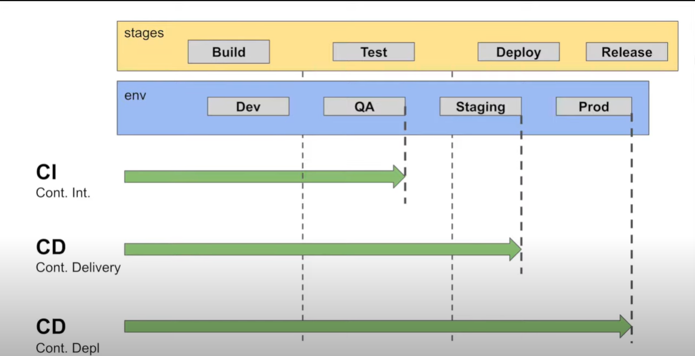
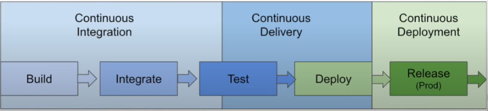

# 401 - Class 02 - TDD (Test Driven Environment), CI/CD (Continuous Delivery/Continuous Deployment)

## Why CI/CD Matters

Continuous Integration and Continuous Deployment/Delivery (CI/CD) are critical practices in modern software development for several reasons:

1. **Accelerates Time to Market**: CI/CD streamlines the software development process, enabling faster product releases. It's like a well-oiled assembly line, ensuring that new features and updates reach users swiftly.

2. **Enhances Product Quality**: By integrating and testing changes frequently, CI/CD helps maintain a high standard of quality. Regular testing is akin to continuous quality checks in a production line, ensuring each part meets stringent standards.

3. **Reduces Development Costs**: Identifying and fixing issues early in the development cycle significantly reduces costs. It's more efficient to fix a problem in its initial stages than after the product has been developed.

4. **Facilitates Better Team Collaboration**: CI/CD fosters a collaborative environment where code is integrated and shared regularly. This collaboration is similar to a team of architects and builders working closely on a construction project, ensuring all pieces fit together perfectly.

5. **Adapts to Market Changes Quickly**: In today’s fast-paced market, the ability to adapt to user feedback and changing market conditions is invaluable. CI/CD allows for quick iterations and updates, much like a responsive service that rapidly adjusts to customer feedback.

6. **Automates Tedious Processes**: Automation of build and testing processes frees developers to focus on more creative and productive tasks, similar to automating repetitive tasks in any field to increase efficiency and focus on innovation.

## What is TDD?

1. **Explain why tests are important. Please explain as though I were your non technical elder.**  

    Imagine you're knitting a sweater. You'd periodically try it on or measure it to ensure it's the right size, right? Similarly, in software development, we write tests to check if our 'digital knitting' is shaping up correctly. It's like having a checklist; each test ensures that a part of the software does exactly what it's supposed to do. This way, we catch mistakes early, ensuring the final software is as perfect as your sweaters!

2. **What are three expected benefits of testing**

    * **Reduced Defect Rates:** Just like double-checking your work can catch mistakes, testing in software development significantly reduces the chances of bugs and errors, making the software more reliable.
    * **Efficiency in Later Stages:** While initially, it might take a bit more effort to write tests, it pays off. Tests make future changes and additions to the software safer and faster, as they ensure new changes don't break existing functionality.
    * **Improved Design and Quality:** Experienced developers report that test-driven development (TDD) leads to better-structured, higher-quality code. It's like planning your knitting pattern in advance, leading to a more consistent and cohesive design.  

3. **Name at lest 2 individual pitfalls and at least 2 team pitfalls commonly encountered while writing tests.**

    * **Forgetting to Run Tests Frequently:** Just like forgetting to regularly check your knitting measurements, not running tests often can lead to issues piling up, making them harder to fix later.
    * **Writing Tests That Are Too Large:** This is like trying to knit a whole sleeve in one go without checking if it fits. Smaller, more focused tests are more effective and easier to manage.

## CI/CD Overview

### What are three benefits of Continuous Integration (CI)?

1. **Early Bug Detection**: Integrating code frequently into a shared repository allows for early detection of errors or conflicts between code changes. This is akin to checking the progress of a building at every stage, ensuring that any issues are identified and resolved early.

2. **Improved Software Quality**: Regular testing and integration improve overall code quality.

3. **Streamlined Development Process**: CI reduces the time and effort required for integrating changes from different team members, much like a well-coordinated team working on a complex project, where everyone's contribution fits seamlessly into the whole.

### Difference between Continuous Delivery and Continuous Deployment

**Continuous Delivery**:

* This is the process where, after integration (CI), the code is automatically deployed to a production-like environment. Here, further automated tests ensure the code is ready for release.
* Imagine this as a final review of a product in a simulated real-world environment before it's shipped to customers.

**Continuous Deployment**:

* In Continuous Deployment, every change that passes the automated tests is automatically deployed to production.
* It's like a conveyor belt in a factory where every product that passes quality checks is immediately packaged and sent out for delivery.

### Explain how GitHub fits into this process assuming the listener comes from a non-technical background

* **GitHub**: Think of GitHub as a digital library where all the drafts and final versions of a project are stored. It's a central place where team members can submit their work, check others' work, and combine these to form the final product.
  
* **In CI/CD**: GitHub acts as the hub where all code integrations occur. It's where team members regularly submit their code (CI), and automated tools can then check this code, merge it with the main project, and prepare it for delivery or deployment (CD).
  
* **For Non-Technical People**: Imagine a group of authors writing different chapters of a book. They all submit their chapters to a central library (GitHub). Every time a chapter is added, it's automatically reviewed and added to the main manuscript. If it's good to go, it's prepared for publishing (Delivery), or in some cases, immediately published (Deployment).

* **Stages of Development**

* **Development Triggers**

## Links to resources used for these notes

* [What is CI/CD, What is CI/CD Pipeline](https://www.youtube.com/watch?v=k2aNsQKwyOo)
* [What is TDD?](https://www.agilealliance.org/glossary/tdd/)
* Chat GPT
