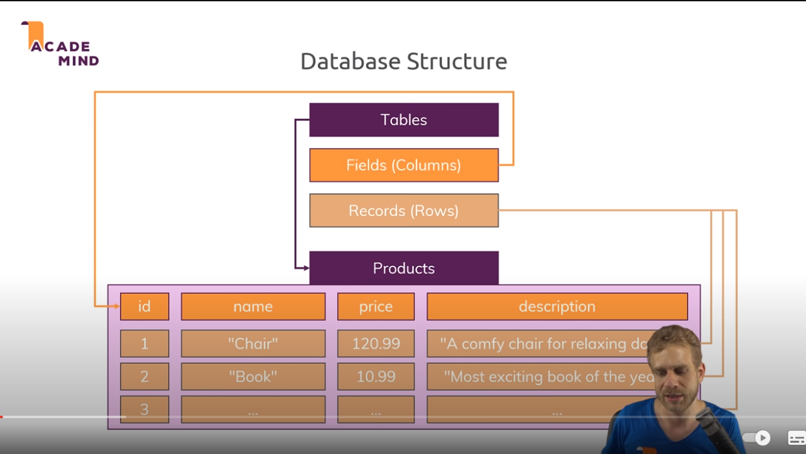
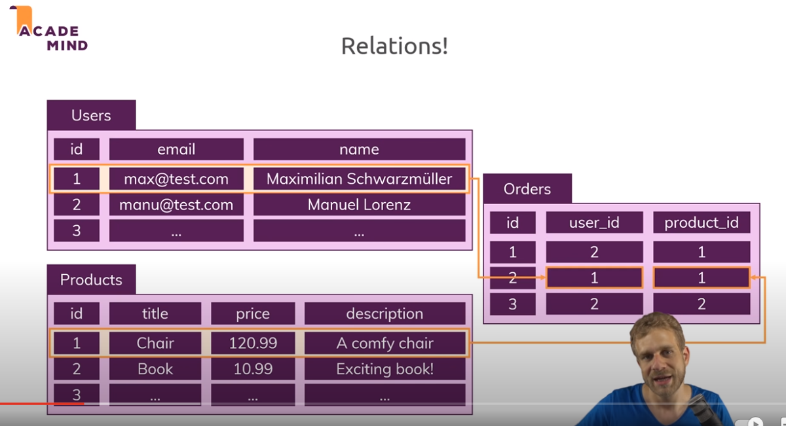
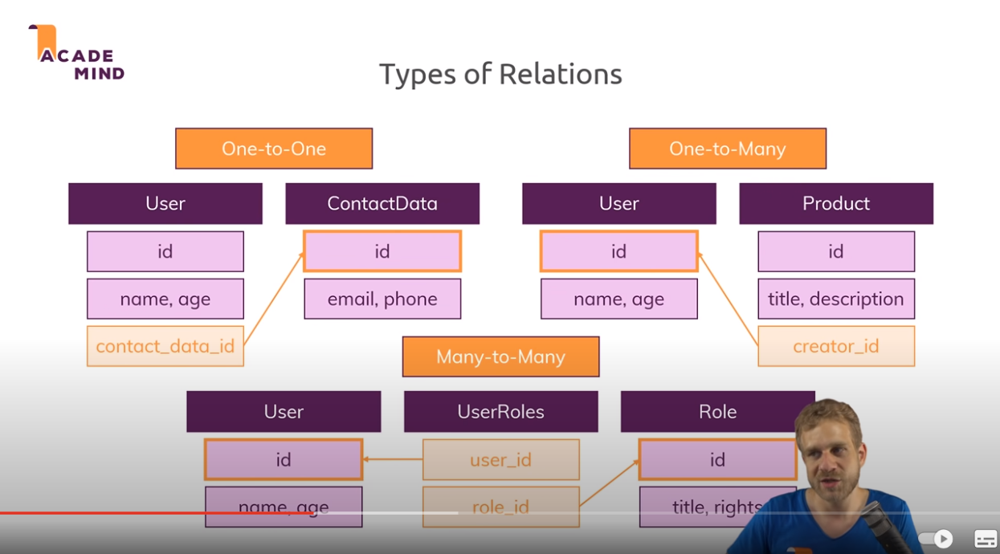
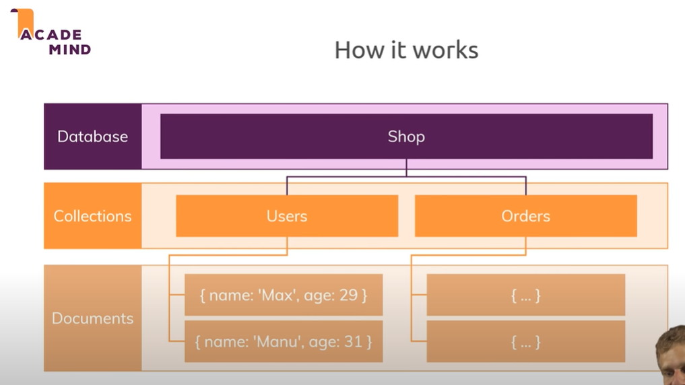
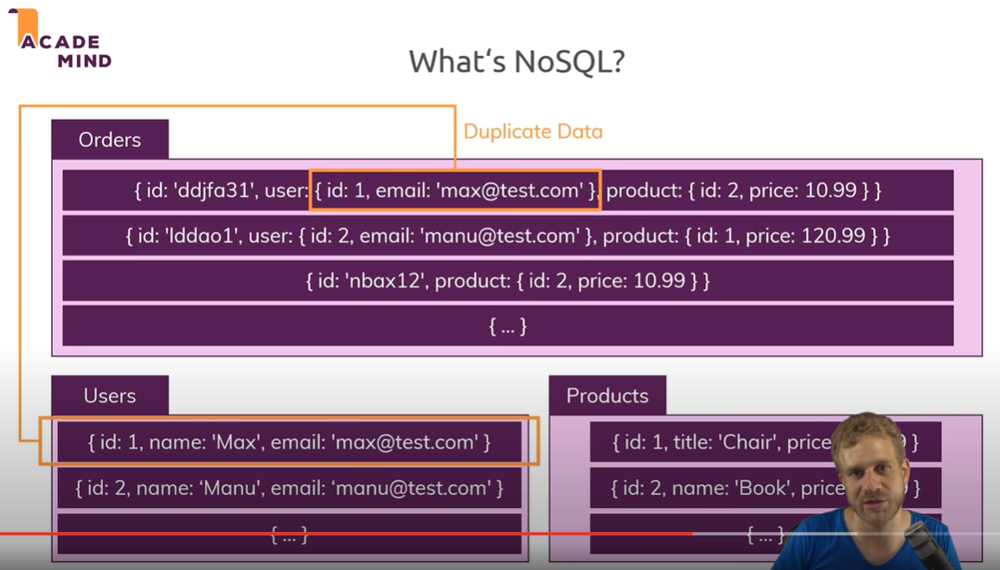
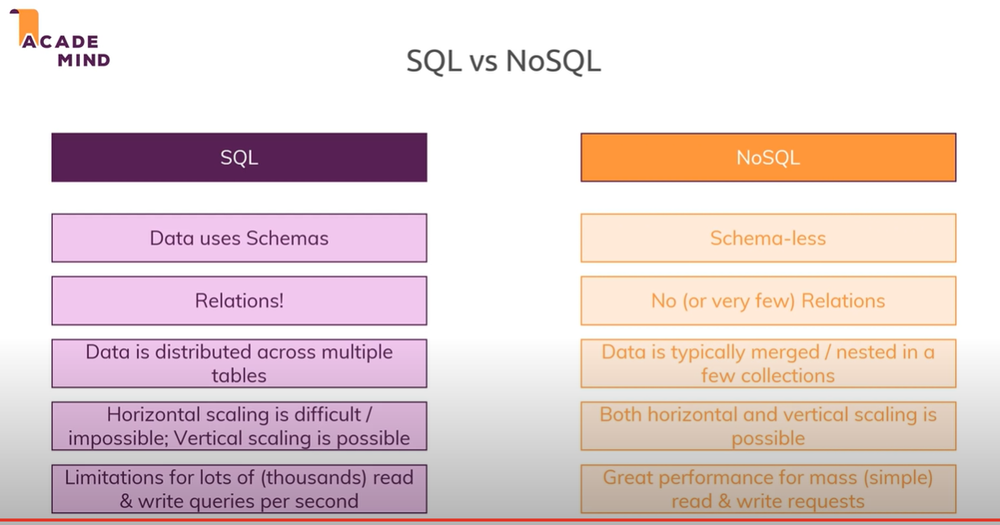

# 401 - Class 04 - Data Modeling

## Why This Topic Matters

## SQL vs NoSQL: Why This Topic Matters

Understanding the differences between SQL (Structured Query Language) and NoSQL databases is crucial for several reasons:

1. **Choosing the Right Tool for the Job**: Knowing the strengths and weaknesses of SQL and NoSQL databases allows developers and database administrators to choose the most appropriate database for their specific application needs. SQL databases are typically better suited for complex queries and transaction-heavy applications, whereas NoSQL databases are often preferred for their scalability and flexibility in handling unstructured data.

2. **Scalability and Performance**: In today's world of big data and real-time web applications, scalability and performance are key considerations. NoSQL databases, like MongoDB or Cassandra, are designed to scale out by distributing data across multiple servers, offering high performance for read and write operations. On the other hand, traditional SQL databases are often scaled up by enhancing the hardware of the existing server.

3. **Data Modeling and Storage**: Understanding SQL and NoSQL helps in better data modeling. SQL databases use a rigid schema that requires data to be stored in rows and columns, which is great for structured data. NoSQL databases offer more flexibility, allowing for storage of unstructured or semi-structured data in various formats like key-value pairs, wide-column stores, or documents.

4. **Development Speed and Flexibility**: NoSQL databases often allow for faster development cycles due to their schema-less nature, which is particularly beneficial in agile development environments where requirements can change rapidly. SQL databases, with their strict schema requirements, ensure data integrity and are preferred in systems where this is a critical factor.

5. **Technological Evolution**: As technology evolves, so do database requirements. NoSQL databases are often more suited to cloud computing environments and can handle the volume, velocity, and variety of big data. Understanding the evolution and applications of these databases is key to staying relevant in the rapidly changing tech landscape.

## nosql vs sql

1. **What type of database is the best fit for the complex query intensive environment?**  

    SQL databases are a good fit for complex query intensive environments. They use a structured query language (SQL) for defining and manipulating data. SQL databases can efficiently handle complex queries, which is not a strength of NoSQL databases.

2. **What type of database is the best fit for hierarchical data storage?**  

    NoSQL databases are better suited for hierarchical data storage. They typically store data in a format similar to JSON, following a key-value pair model. This structure aligns well with hierarchical data, unlike SQL databases which are table-based and not best fit for this purpose.

3. **Describe the differences in scalability between a SQl and NoSQL database as though you were speaking to a non-technical friend.**  

    **SQL Database Scalability**:

    Think of a SQL database like a single, powerful truck. When you have more goods to transport (more data), you make the truck bigger and more powerful (you scale vertically). This means adding more resources like a bigger engine or more storage space (CPU, RAM, SSD) to your existing server.

    **NoSQL Database Scalability**:

    Now, imagine a NoSQL database as a fleet of smaller trucks. Instead of making one truck bigger, you just add more trucks to the fleet when you have more goods to transport (scaling horizontally). So, when your data grows, you add more servers to your database system, spreading out the load and work across multiple machines.

## sql modeling techniques

1. **Among data tables, what is a one-to-many relationship and how do we “relate” them?**  

    **One-to-Many Relationship**:

    - A one-to-many relationship in database modeling is where a record in one table can be associated with one or more records in another table. For example, consider a table of `Users` and another table of `Orders`. One user can place multiple orders, but each order is placed by only one user.

    **Relating Tables in One-to-Many**:

    - To establish relationship, use a **foreign key** in the 'many' table that references the **primary key** of the 'one' table. In the above example, the `Orders` table will have a foreign key column, often named `UserID`, that references the `Users` table's primary key. This way, each order is linked to the user who placed it.

2. **Prior to designing your relational database, it might be useful to creare a diagram of the database tables and their relationships.**  

    **Importance of Creating a Diagram**:

    - Creating a diagram before designing a relational database is beneficial for visualizing the structure and relationships of the data. This diagram, often called an **Entity-Relationship Diagram (ERD)**, helps in understanding how tables connect through relationships (like one-to-many, many-to-many), ensuring efficient and logical data organization.

    - It aids in identifying necessary tables, their attributes, and how they interact, reducing complexities and potential issues in the database design process.

3. **Explain the difference between a primary and foreign key.**

    **Primary Key**:

    - A primary key is a unique identifier for each record in a database table. It must contain unique values and cannot be null. This key uniquely identifies each row in the table. For instance, a `UserID` in a `Users` table uniquely identifies each user.

    **Foreign Key**:

    - A foreign key, on the other hand, is a field (or collection of fields) in one table that uniquely identifies a row of another table. The foreign key is used to establish and enforce a link between the data in two tables. It corresponds to the primary key in the referenced table, creating a relationship between the two. For example, the `UserID` in the `Orders` table would be a foreign key linking each order to a user in the `Users` table.

## Video sql vs nosql

1. **How do we treat keywords and parameters differently in SQL syntax?**

    **Keywords vs Parameters in SQL Syntax**:
    - In SQL syntax, **keywords** are predefined, reserved words used by the SQL engine to parse and understand the structure of SQL commands. Examples include `SELECT`, `FROM`, `WHERE`, `INSERT`, etc. They are part of the SQL language specification and cannot be modified.

    **Parameters**, on the other hand, are the values or variables provided by the user or application to be used in the SQL command. They represent data values like table names, column names, or filter criteria. Parameters are not part of the SQL language itself but are inputs to the SQL statements that execute against the database.

2. **Define normalization within the context of schemas and data.**

    **Normalization in Database Schemas and Data**:

    - Normalization is a process in database design used to organize data to reduce redundancy and improve data integrity. It involves structuring a database in a way that each data element is stored only once (where possible) and by establishing relationships between tables.

    - The process of normalization involves dividing large tables into smaller, more manageable tables and defining relationships between them. It is typically done in stages, each stage representing a "normal form," which are sets of rules for structuring tables. Normalization helps in maintaining consistency and can make the database more efficient to query.

3. **Explain the difference between one-to-one, one-to-many, and many-to-many relationships to a non-technical recruiter.**

    **One-to-One Relationship**:

    - This is like a married couple. Each person in the relationship corresponds to exactly one person in the other group. For example, each employee has one unique employee ID, and each employee ID is assigned to only one employee.

    **One-to-Many Relationship**:

    - Imagine a mother with children. One mother can have multiple children, but each child has only one biological mother. In database terms, a customer can have many orders, but each order is made by one specific customer.

    **Many-to-Many Relationship**:

    - This is like students and classes in a school. A student can enroll in many classes, and each class can have many students enrolled in it. In databases, this is often managed with an intermediary table that records each unique combination of the 'many' relationships, like a table for student-class enrollments.

### Screenshots from video

  **SQL Structure**
  

  **SQL Relations**
  

  **SQL Types of Relations**
  

  **NoSQL Diagram**
  

  **NoSql Example**
  

  **NoSQL vs SQL**
  

## Links to resources used for these notes

- [nosql vs sql](https://www.thegeekstuff.com/2014/01/sql-vs-nosql-db/?utm_source=tuicool)
- [sql modeling techniques](https://www.essentialsql.com/get-ready-to-learn-sql-7-simplified-data-modeling/)
- [Video - sql vs nosql](https://www.youtube.com/watch?v=ZS_kXvOeQ5Y)
- Chat GPT
